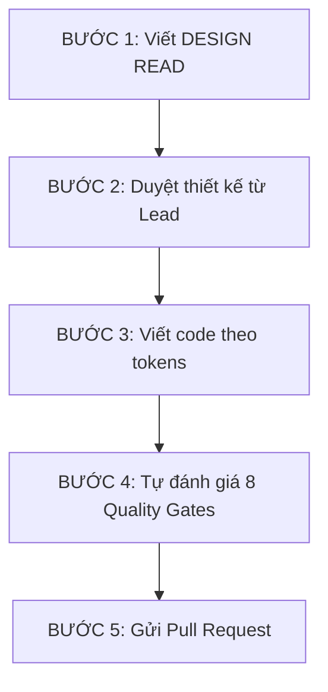

# HƯỚNG DẪN PHÁT TRIỂN & ONBOARDING DỰ ÁN IS TIMES
> **Chào mừng bạn gia nhập đội ngũ phát triển IS Times!** Tài liệu này sẽ giúp bạn nhanh chóng làm quen với kiến trúc dự án, triết lý thiết kế độc bản, hệ thống Design Tokens và quy trình phát triển bắt buộc để đảm bảo chất lượng sản phẩm cao nhất.

---

## MỤC LỤC
1. [Triết Lý Thiết Kế & Định Vị Thương Hiệu](#1-triết-lý-thiết-kế--định-vị-thương-hiệu)
2. [Cài Đặt Môi Trường & Lệnh Cơ Bản](#2-cài-đặt-môi-trường--lệnh-cơ-bản)
3. [Cấu Trúc Thư Mục Dự Án](#3-cấu-trúc-thư-mục-dự-án)
4. [Hệ Thống Design Tokens (Tailwind CSS v4)](#4-hệ-thống-design-tokens-tailwind-css-v4)
5. [Quy Trình Phát Triển Bắt Buộc (Mandatory Workflow)](#5-quy-trình-phát-triển-bắt-buộc-mandatory-workflow)
6. [Hệ Thống Kiểm Soát Chất Lượng (8 Quality Gates)](#6-hệ-thống-kiểm-soát-chất-lượng-8-quality-gates)
7. [Hướng Dẫn Tạo & Cấu Trúc Component Mới (Kèm Code Mẫu)](#7-hướng-dẫn-tạo--cấu-trúc-component-mới-kèm-code-mẫu)

---

## 1. TRIẾT LÝ THIẾT KẾ & ĐỊNH VỊ THƯƠNG HIỆU

Dự án **IS Times** không phải là một landing page công nghệ chung chung, một trang web khởi nghiệp (SaaS), hay trang quản trị khô khan. Đây là **"Mái Nhà Xanh"** - trang thông tin và kết nối chính thức của Liên chi Hội khoa Hệ thống Thông tin.

Thiết kế luôn phải cân bằng giữa hai trục giá trị chính:
*   **Ấm áp (Warm Family):** Thân thiện, gắn kết, thuộc về, đậm chất sinh viên Việt Nam.
*   **Chính xác (Modern Technology):** Khoa học, dữ liệu, hiện đại, mang tính công nghệ của khoa HTTT.

> [!IMPORTANT]
> **Quy tắc vàng:** Thiết kế phải kết hợp hài hòa cả 2 yếu tố trên. Tránh nền đen neon sặc sỡ kiểu cyberpunk hoặc nền màu be đơn điệu kiểu editorial. Nếu một chi tiết chỉ đẹp mà không truyền tải được sự ấm áp hoặc tính công nghệ, hãy loại bỏ nó.

---

## 2. CÀI ĐẶT MÔI TRƯỜNG & LỆNH CƠ BẢN

Dự án sử dụng **Angular 21+** (chạy trên môi trường SSR) và **Tailwind CSS v4** (CSS-first engine).

### Lệnh chạy dự án
Chạy các lệnh này tại thư mục `website-doan-khoa-httt`:

```bash
# 1. Di chuyển vào thư mục frontend
cd website-doan-khoa-httt

# 2. Cài đặt các thư viện phụ thuộc
npm install

# 3. Khởi chạy server phát triển local (mặc định tại http://localhost:4200)
ng serve

# 4. Chạy kiểm thử tự động (Unit Test với Vitest)
ng test

# 5. Build production bundle (được lưu tại thư mục dist/)
ng build
```

---

## 3. CẤU TRÚC THƯ MỤC DỰ ÁN

```text
WEBSITE_DOAN_KHOA_HTTT/
├── backend/                             # Phần xử lý backend (hiện tại chưa dùng)
└── website-doan-khoa-httt/              # Thư mục chính của ứng dụng Angular
    ├── public/
    │   └── LogoWeb.png                  # Logo chính thức của Đoàn khoa (cấm vẽ lại/sửa đổi)
    ├── src/
    │   ├── app/
    │   │   ├── hero/                    # Component Hero mẫu đã được cài đặt sẵn GSAP
    │   │   ├── app.config.ts            # Cấu hình chính của Angular Application
    │   │   ├── app.routes.ts            # Quản lý định tuyến (Routing)
    │   │   ├── app.ts                   # Component gốc của ứng dụng (Root Component)
    │   │   └── app.html                 # Template gốc của ứng dụng
    │   ├── assets/                      # Hình ảnh, font chữ tĩnh
    │   ├── index.html                   # Entrypoint HTML
    │   ├── main.ts                      # Entrypoint Javascript
    │   └── styles.scss                  # Tệp style toàn cục (Chứa cấu hình Tailwind @theme)
```

---

## 4. HỆ THỐNG DESIGN TOKENS (TAILWIND CSS V4)

Toàn bộ dự án phải sử dụng hệ thống token được định nghĩa trong [styles.scss](file:///d:/WEBSITE_DOAN_KHOA_HTTT/website-doan-khoa-httt/src/styles.scss). **Nghiêm cấm tự ý hardcode mã màu hoặc giá trị bo góc rời rạc.**

### 4.1. Màu sắc thương hiệu & Ngữ nghĩa
*   `--color-primary` (`#003087`): Màu Navy chính thức của Đoàn/Hội. Dùng cho Header, Footer, chữ nhấn mạnh quan trọng.
*   `--color-tech` (`#1E40AF`): Xanh Blue điện tử đại diện cho công nghệ. Dùng cho links, icons khi active, border khi focus.
*   `--color-tech-light` (`#3B82F6`): Blue sáng hơn. Dùng cho hover state hoặc hiệu ứng glow nhẹ.
*   `--color-green` (`#16A34A`): Trục ấm áp. Dùng cho **Badge và các trạng thái Thành công** ("đang diễn ra", "đã mở đăng ký", Toast thông báo).
*   `--color-green-light` (`#DCFCE7`): Nền nhạt cho badge xanh lá.
*   `--color-accent` (`#DC2626`): Đỏ nhấn. **Chỉ dùng duy nhất cho nút CTA chính (Đăng ký tham gia) và số liệu thống kê cực kỳ nổi bật.**
*   `--color-surface` (`#F8FAFC`): Màu nền mặc định của trang.
*   `--color-surface-alt` (`#EEF2FF`): Màu nền xen kẽ giữa các phần (tint xanh dương cực nhạt) giúp tạo nhịp điệu cho trang (không dùng xám trơn).
*   `--color-card` (`#FFFFFF`): Nền của thẻ nội dung (luôn đi kèm shadow để phân tách khỏi nền).
*   `--color-ink` (`#1A1A2E`): Màu chữ chính.

> [!WARNING]
> Không tự chế thêm các tông màu cam, vàng, neon, hồng,... khác vào giao diện. Nếu 2 CTA đỏ đứng cạnh nhau, bắt buộc một nút phải dùng kiểu `outline` (nền trắng, viền xanh dương) để giảm sự tranh chấp thị giác.

### 4.2. Typography (Phông chữ)
*   **Heading:** Dùng font `Montserrat` (`--font-heading`). Chỉ dùng font-weight từ `600` đến `800` (Không dùng font-weight 400).
*   **Body:** Dùng font `Inter` (`--font-body`). Font-weight `400` hoặc `500` cho đọc và `600` cho nhấn mạnh cụm từ inline.
*   **Mono:** Dùng `JetBrains Mono` (`--font-mono`). **Chỉ dùng cho:** ngày giờ sự kiện, mã lớp/mã số sinh viên, số liệu thống kê. Không dùng cho văn bản thường.

### 4.3. Bo góc (Border Radius) & Bóng đổ (Shadows)
*   Thẻ (Card): `--radius-card: 24px` (Cố định cho mọi card nội dung).
*   Nút bấm (Button): `--radius-button: 9999px` (Bo tròn dạng viên thuốc - pill).
*   Ô nhập liệu (Input): `--radius-input: 12px`.
*   Ảnh minh họa: `--radius-image: 16px` (Để phân biệt với khung card).
*   Hiệu ứng bóng đổ: `--shadow-sm`, `--shadow-md`, `--shadow-lg`.
*   Hiệu ứng Glow: `--shadow-glow-tech`, `--shadow-glow-green`, `--shadow-glow-accent`, `--shadow-glow-photo`.

---

## 5. QUY TRÌNH PHÁT TRIỂN BẮT BUỘC (MANDATORY WORKFLOW)

Để đảm bảo code của bạn được phê duyệt nhanh chóng, hãy tuân thủ 3 bước sau:



1.  **Viết DESIGN READ trước khi code:** Hãy phác thảo sơ bộ layout bằng ASCII wireframe và bảng màu áp dụng vào một tài liệu nháp hoặc ghi chú PR trước khi đặt tay viết dòng code đầu tiên.
2.  **Lập trình bằng Tokens:** Chỉ sử dụng các biến CSS được khai báo sẵn.
3.  **Kiểm tra các Quality Gates:** Tự chạy qua checklist 8 Gates ở phần dưới trước khi gửi PR của bạn.

---

## 6. HỆ THỐNG KIỂM SOÁT CHẤT LƯỢNG (8 QUALITY GATES)

Mỗi đoạn mã bạn commit lên nhánh phát triển chung phải đáp ứng được 8 tiêu chí kiểm tra sau:

*   **Gate 1 (Dấu gạch ngang):** Chỉ sử dụng dấu gạch ngang ngắn `-` thay vì `—` trong văn phong tiếng Việt (Trừ các trường hợp đặc biệt như ngày tháng `20/11/2026`, số điện thoại, URL hoặc danh sách markdown).
*   **Gate 2 (Design Read):** Phải có mô tả thiết kế, ASCII wireframe gửi cho Lead duyệt trước khi code.
*   **Gate 3 (Section Rhythm):** Hai khối giao diện nằm liền kề nhau trên cùng một trang **không được dùng chung cấu trúc layout** (Ví dụ: Tránh đặt hai grid card 3 cột liên tiếp nhau; hãy chèn một khối text/ảnh xen kẽ hoặc Carousel ở giữa).
*   **Gate 4 (Hero Discipline):** Tiêu đề chính (H1) tối đa 2 dòng trên màn hình desktop. Nút hành động chính (CTA) phải hiển thị ngay trong khung hình đầu tiên mà không cần cuộn trang ở cả máy tính (1280x800) và điện thoại (375x812).
*   **Gate 5 (Theme Audit):** Khớp đúng giá trị bo góc và mã màu. Không có bất kỳ mã hex màu thô nào (`#ffffff`, `#000`...) được hardcode trong HTML/SCSS component của bạn.
*   **Gate 6 (Accessibility):** Tỉ lệ tương phản chữ đạt tối thiểu 4.5:1. Mọi phần tử nhấn chọn được phải có hiệu ứng focus rõ ràng (`--color-border-focus`). Tắt hoặc giảm thiểu animation (GSAP) khi user bật cài đặt giảm chuyển động (`prefers-reduced-motion: reduce`).
*   **Gate 7 (Content Voice):** Giọng văn ấm áp, trẻ trung, xưng hô là "Đoàn khoa" hoặc "mình" với sinh viên. Nút bấm mang tính hành động cụ thể (Ví dụ: "Đăng ký tham gia", "Xem chi tiết sự kiện" thay vì "Xem thêm", "Submit").
*   **Gate 8 (State Completeness):** Luôn chuẩn bị đầy đủ 3 trạng thái cho các component lấy dữ liệu từ API:
    1.  *Loading:* Sử dụng hiệu ứng Skeleton loader, không dùng spinner xoay tròn trơn trọc.
    2.  *Empty:* Có text giải thích thân thiện và nút hành động gợi ý (Không để trống màn hình).
    3.  *Error:* Chỉ rõ lỗi phát sinh kèm nút bấm "Thử lại".

---

## 7. HƯỚNG DẪN TẠO & CẤU TRÚC COMPONENT MỚI (KÈM CODE MẪU)

Để tạo một component mới (ví dụ: danh sách sự kiện - `event-list`), hãy làm theo các bước chuẩn mực sau:

### Bước 1: Tạo Component bằng Angular CLI
```bash
ng g c components/event-list --style=scss --type=component
```

### Bước 2: Cấu trúc tệp TypeScript (`event-list.ts`)
Khi làm việc với các chuyển động phức tạp (GSAP), hãy nhớ bọc chúng trong kiểm tra môi trường browser để tránh lỗi crash lúc SSR render trên Server side.

```typescript
import { Component, OnInit, ElementRef, OnDestroy, inject, PLATFORM_ID } from '@angular/core';
import { CommonModule, isPlatformBrowser } from '@angular/common';

// Định nghĩa kiểu dữ liệu chặt chẽ
interface EventItem {
  id: string;
  title: string;
  date: string;
  status: 'opening' | 'closed';
  image: string;
}

@Component({
  selector: 'app-event-list',
  standalone: true,
  imports: [CommonModule],
  templateUrl: './event-list.html',
  styleUrl: './event-list.scss'
})
export class EventListComponent implements OnInit, OnDestroy {
  // Inject các dependencies cần thiết
  private readonly elementRef = inject(ElementRef<HTMLElement>);
  private readonly platformId = inject(PLATFORM_ID);
  
  // Quản lý GSAP Context để giải phóng bộ nhớ khi Component bị hủy
  private gsapContext?: any;

  // Dữ liệu mock phục vụ các trạng thái (Gate 8)
  protected events: EventItem[] = [];
  protected isLoading = false;
  protected hasError = false;

  ngOnInit(): void {
    this.fetchEvents();
  }

  protected fetchEvents(): void {
    this.isLoading = true;
    this.hasError = false;
    
    // Giả lập cuộc gọi API
    setTimeout(() => {
      this.events = [
        {
          id: 'IS-001',
          title: 'Hội thảo Định hướng Chuyên ngành HTTT 2026',
          date: '20/10/2026',
          status: 'opening',
          image: 'assets/events/orientation.jpg'
        },
        {
          id: 'IS-002',
          title: 'Giải Bóng đá truyền thống IS Cup',
          date: '15/11/2026',
          status: 'closed',
          image: 'assets/events/is-cup.jpg'
        }
      ];
      this.isLoading = false;
      this.initAnimations();
    }, 1000);
  }

  private async initAnimations(): Promise<void> {
    // CHỈ khởi chạy animation trên môi trường Trình duyệt (tránh lỗi SSR)
    if (!isPlatformBrowser(this.platformId)) return;

    // Tắt animation nếu người dùng bật chế độ prefers-reduced-motion
    const prefersReducedMotion = window.matchMedia('(prefers-reduced-motion: reduce)').matches;
    if (prefersReducedMotion) return;

    // Load động GSAP giúp tối ưu hóa bundle size lúc tải trang
    const { gsap } = await import('gsap');
    const { ScrollTrigger } = await import('gsap/ScrollTrigger');
    gsap.registerPlugin(ScrollTrigger);

    this.gsapContext = gsap.context(() => {
      gsap.from('.event-card', {
        scrollTrigger: {
          trigger: '.event-grid',
          start: 'top 80%',
          toggleActions: 'play none none none'
        },
        opacity: 0,
        y: 24,
        duration: 0.6,
        stagger: 0.15,
        ease: 'power2.out'
      });
    }, this.elementRef.nativeElement);
  }

  ngOnDestroy(): void {
    // Luôn dọn dẹp các trigger hoạt cảnh của GSAP để tránh rò rỉ bộ nhớ
    if (this.gsapContext) {
      this.gsapContext.revert();
    }
  }
}
```

### Bước 3: Cấu trúc tệp Template HTML (`event-list.html`)
HTML phải đảm bảo đầy đủ các trạng thái của dữ liệu động (Loading, Empty, Error) và ngữ âm thân thiện chuẩn sinh viên.

```html
<section class="event-section">
  <div class="container">
    
    <!-- Tiêu đề nhóm sự kiện -->
    <div class="section-header">
      <span class="eyebrow-label">Hoạt động sắp tới</span>
      <h2 class="section-title">Nhịp Đập Sự Kiện Đoàn Khoa</h2>
      <p class="section-desc">Nơi tụ hội những chương trình bổ ích, năng động dành riêng cho dân IS.</p>
    </div>

    <!-- TRẠNG THÁI 1: ĐANG LOADING (Sử dụng Skeleton Screens) -->
    <div *ngIf="isLoading" class="event-grid">
      <div class="skeleton-card" *ngFor="let item of [1, 2]">
        <div class="skeleton-image"></div>
        <div class="skeleton-text skeleton-title"></div>
        <div class="skeleton-text skeleton-body"></div>
      </div>
    </div>

    <!-- TRẠNG THÁI 2: XẢY RA LỖI (Có thông tin cụ thể & nút thử lại) -->
    <div *ngIf="!isLoading && hasError" class="error-container">
      <p class="error-message">Không tải được danh sách sự kiện - Vui lòng kiểm tra lại kết nối mạng.</p>
      <button class="btn btn-secondary" (click)="fetchEvents()">Thử tải lại</button>
    </div>

    <!-- TRẠNG THÁI 3: DANH SÁCH RỖNG (Lời mời gọi hành động) -->
    <div *ngIf="!isLoading && !hasError && events.length === 0" class="empty-container">
      <p class="empty-message">Hiện tại chưa có sự kiện mới. Sự kiện đang được chuẩn bị - Hãy theo dõi fanpage để nhận tin sớm nhất nhé!</p>
      <a href="https://facebook.com/k.httt" target="_blank" rel="noopener" class="btn btn-primary">Ghé thăm Fanpage</a>
    </div>

    <!-- TRẠNG THÁI 4: HIỂN THỊ DỮ LIỆU CHÍNH -->
    <div *ngIf="!isLoading && !hasError && events.length > 0" class="event-grid">
      <article *ngFor="let event of events" class="event-card">
        
        <!-- Ảnh có bo góc 16px -->
        <div class="card-image-wrapper">
          
          
          <!-- Badge trạng thái (xanh lá nếu opening) -->
          <span *ngIf="event.status === 'opening'" class="status-badge" data-status="opening">
            Đang mở đăng ký
          </span>
          <span *ngIf="event.status === 'closed'" class="status-badge" data-status="closed">
            Đã đóng
          </span>
        </div>

        <div class="card-content">
          <!-- Text thời gian dùng JetBrains Mono -->
          <time class="event-time">{{ event.date }}</time>
          <h3 class="card-title">{{ event.title }}</h3>
          
          <div class="card-actions">
            <!-- CTA Đỏ chính nếu sự kiện đang mở -->
            <button *ngIf="event.status === 'opening'" class="btn btn-primary">
              Đăng ký tham gia
            </button>
            <!-- CTA Phụ nếu sự kiện đã đóng -->
            <button *ngIf="event.status === 'closed'" class="btn btn-outline" disabled>
              Đã hết hạn đăng ký
            </button>
          </div>
        </div>
      </article>
    </div>

  </div>
</section>
```

### Bước 4: Cấu trúc tệp Styles SCSS (`event-list.scss`)
Tận dụng các biến CSS từ Tailwind v4 theme, tuyệt đối không viết mã màu thô.

```scss
.event-section {
  padding-top: var(--spacing-24);
  padding-bottom: var(--spacing-24);
  background-color: var(--color-surface); // Sử dụng màu nền mặc định
}

.container {
  max-width: 1200px;
  margin-left: auto;
  margin-right: auto;
  padding-left: var(--spacing-4);
  padding-right: var(--spacing-4);
}

.section-header {
  text-align: center;
  margin-bottom: var(--spacing-12);

  .eyebrow-label {
    font-family: var(--font-mono); // Mono cho các label nhỏ
    font-size: var(--text-caption);
    color: var(--color-tech);
    text-transform: uppercase;
    letter-spacing: 0.05em;
    font-weight: 600;
  }

  .section-title {
    font-family: var(--font-heading);
    font-size: var(--text-h2);
    color: var(--color-ink);
    margin-top: var(--spacing-2);
    font-weight: 700;
  }

  .section-desc {
    color: var(--color-ink-muted);
    font-size: var(--text-body-lg);
    margin-top: var(--spacing-3);
  }
}

// Bố cục Grid
.event-grid {
  display: grid;
  grid-template-columns: 1fr;
  gap: var(--spacing-8);

  @media (min-width: 768px) {
    grid-template-columns: repeat(2, 1fr);
  }
}

// Cấu trúc Card sử dụng token radius-card (24px)
.event-card {
  background-color: var(--color-card);
  border-radius: var(--radius-card);
  border: 1px solid var(--color-border);
  overflow: hidden;
  box-shadow: var(--shadow-md);
  transition: transform 0.3s cubic-bezier(0.16, 1, 0.3, 1), box-shadow 0.3s ease;

  &:hover {
    transform: translateY(-6px);
    box-shadow: var(--shadow-lg);
  }
}

.card-image-wrapper {
  position: relative;
  overflow: hidden;
  margin: var(--spacing-4); // Tạo khoảng đệm
  border-radius: var(--radius-image); // Dùng radius-image (16px) thay vì radius-card
  aspect-ratio: 16 / 9;

  .card-image {
    width: 100%;
    height: 100%;
    object-fit: cover;
  }
}

// Trạng thái badge xanh lá "ấm áp"
.status-badge {
  position: absolute;
  top: var(--spacing-3);
  right: var(--spacing-3);
  padding: var(--spacing-2) var(--spacing-4);
  border-radius: var(--radius-badge);
  font-family: var(--font-body);
  font-size: var(--text-caption);
  font-weight: 600;

  &[data-status="opening"] {
    background-color: var(--color-green-light);
    color: var(--color-green);
    box-shadow: var(--shadow-glow-green);
  }

  &[data-status="closed"] {
    background-color: var(--color-border);
    color: var(--color-ink-muted);
  }
}

.card-content {
  padding: 0 var(--spacing-6) var(--spacing-6) var(--spacing-6);
}

.event-time {
  font-family: var(--font-mono); // Dành cho thời gian
  font-size: var(--text-caption);
  color: var(--color-ink-subtle);
  display: block;
  margin-bottom: var(--spacing-2);
}

.card-title {
  font-family: var(--font-heading);
  font-size: var(--text-h5);
  color: var(--color-ink);
  font-weight: 600;
  line-height: 1.4;
  margin-bottom: var(--spacing-4);
}

// Button styles theo quy chuẩn bo góc viên thuốc (pill)
.btn {
  display: inline-flex;
  align-items: center;
  justify-content: center;
  padding: var(--spacing-3) var(--spacing-6);
  border-radius: var(--radius-button);
  font-family: var(--font-body);
  font-weight: 600;
  font-size: var(--text-body-sm);
  cursor: pointer;
  transition: background-color 0.25s, transform 0.2s;
  border: 1px solid transparent;

  &:active {
    transform: scale(0.98);
  }

  // CTA đỏ chính chỉ dùng cho Đăng ký sự kiện
  &.btn-primary {
    background-color: var(--color-accent);
    color: var(--color-on-primary);

    &:hover {
      background-color: var(--color-accent-hover);
      box-shadow: var(--shadow-glow-accent);
    }
  }

  // Nút viền phụ
  &.btn-outline {
    background-color: transparent;
    border-color: var(--color-tech);
    color: var(--color-tech);

    &:hover {
      background-color: var(--color-surface-alt);
    }
  }
}

// Trạng thái Loading Skeletons
.skeleton-card {
  background-color: var(--color-card);
  border-radius: var(--radius-card);
  padding: var(--spacing-4);
  border: 1px solid var(--color-border);

  .skeleton-image {
    background: linear-gradient(90deg, #f1f5f9 25%, #e2e8f0 50%, #f1f5f9 75%);
    background-size: 200% 100%;
    animation: skeleton-loading 1.5s infinite;
    aspect-ratio: 16 / 9;
    border-radius: var(--radius-image);
    margin-bottom: var(--spacing-4);
  }

  .skeleton-text {
    background: linear-gradient(90deg, #f1f5f9 25%, #e2e8f0 50%, #f1f5f9 75%);
    background-size: 200% 100%;
    animation: skeleton-loading 1.5s infinite;
    height: 16px;
    border-radius: 4px;
    margin-bottom: var(--spacing-2);

    &.skeleton-title {
      width: 75%;
      height: 24px;
      margin-bottom: var(--spacing-4);
    }

    &.skeleton-body {
      width: 50%;
    }
  }
}

@keyframes skeleton-loading {
  0% { background-position: 200% 0; }
  100% { background-position: -200% 0; }
}

// Đảm bảo tôn trọng prefers-reduced-motion toàn cục
@media (prefers-reduced-motion: reduce) {
  .event-card {
    transition: none !important;
    &:hover {
      transform: none !important;
    }
  }
  .btn {
    transition: none !important;
  }
  .skeleton-image, .skeleton-text {
    animation: none !important;
    background: #e2e8f0 !important;
  }
}
```

---

## 8. LIÊN HỆ & HỖ TRỢ
Nếu bạn gặp bất kỳ vấn đề gì về thiết kế hoặc thắc mắc về kỹ thuật:
1. Đọc lại các hướng dẫn chi tiết trong tệp `DOAN_KHOA_HTTT_SKILL.md` và `DOAN_KHOA_HTTT_MASTER_PROMPT.md` tại thư mục gốc.
2. Trao đổi trực tiếp trên kênh Slack / Discord của dự án tại mục `#dev-team`.

**Hãy cùng nhau xây dựng "Mái Nhà Xanh" thật chỉn chu và đầy tính công nghệ nhé!**
