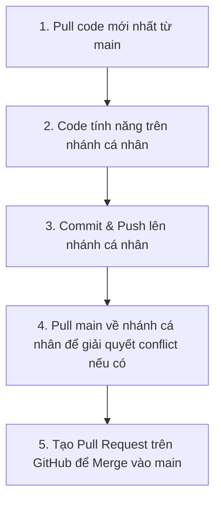

# HƯỚNG DẪN SỬ DỤNG GIT & QUY TRÌNH HỢP TÁC NHÓM
## DỰ ÁN WEBSITE ĐOÀN KHOA HTTT (IS TIMES)

Tài liệu này hướng dẫn chi tiết quy trình quản lý mã nguồn bằng Git dành riêng cho các thành viên phát triển dự án **IS Times**. Hãy tuân thủ nghiêm ngặt quy trình này để tránh xung đột mã nguồn (conflict) và mất mát dữ liệu.

---

## 1. HỆ THỐNG CÁC NHÁNH (BRANCHES)

Dự án sử dụng mô hình Git Workflow đơn giản và hiệu quả với các nhánh sau:

| Tên Nhánh | Người chịu trách nhiệm | Quyền hạn & Quy tắc |
| :--- | :--- | :--- |
| **`main`** | **Cả nhóm** | **Nhánh chính (Production):** Chứa code ổn định nhất. **CẤM** push trực tiếp lên `main`. Mọi thay đổi phải thông qua Pull Request (PR) và được review. |
| **`HoangDuc`** | Hoàng Đức | Nhánh phát triển cá nhân của Hoàng Đức. |
| **`HuynhBao`** | Huỳnh Bảo | Nhánh phát triển cá nhân của Huỳnh Bảo. |
| **`DungMuoi`** | Dung Muối | Nhánh phát triển cá nhân của Dung Muối. |
| **`PhuongAnh`** | Phương Anh | Nhánh phát triển cá nhân của Phương Anh. |

> [!NOTE]
> Khuyến khích các thành viên khi làm tính năng lớn hoặc sửa lỗi phức tạp nên tạo nhánh con từ nhánh cá nhân của mình (ví dụ: `HoangDuc/feature-login`, `HuynhBao/fix-footer`), sau đó merge vào nhánh cá nhân trước khi đưa lên `main`.

---

## 2. QUY TRÌNH LÀM VIỆC TIÊU CHUẨN (DAILY WORKFLOW)

Quy trình phát triển code hàng ngày của một thành viên gồm 5 bước khép kín như sau:



### Bước 1: Cập nhật code mới nhất từ `main` đầu ngày làm việc
Trước khi bắt đầu code bất cứ thứ gì, bạn cần cập nhật các thay đổi mới nhất mà người khác đã merge vào `main`.
```bash
# Chuyển về nhánh main
git checkout main

# Pull code mới nhất từ server về
git pull origin main
```

### Bước 2: Chuyển sang nhánh cá nhân và merge code từ `main` vào
```bash
# Chuyển về nhánh cá nhân của bạn (ví dụ: HoangDuc)
git checkout <Ten_Nhanh_Cua_Ban>

# Hợp nhất code mới nhất từ main vào nhánh cá nhân của bạn
git merge main
```
*Lưu ý: Nếu có conflict (xung đột), hãy dùng VS Code để resolve (giải quyết) và commit.*

### Bước 3: Phát triển tính năng & Commit
Làm việc trên các file code của bạn. Sau khi xong một tính năng nhỏ hoặc cuối buổi làm việc:
```bash
# Kiểm tra các file đã thay đổi
git status

# Thêm tất cả các file thay đổi vào khu vực chuẩn bị commit
git add .

# Commit code kèm mô tả rõ ràng
git commit -m "feat: thêm giao diện danh sách sự kiện"
```

### Bước 4: Push code lên nhánh cá nhân của bạn trên GitHub
```bash
git push origin <Ten_Nhanh_Cua_Ban>
```

### Bước 5: Tạo Pull Request (PR) để Merge vào `main`
1. Truy cập vào kho chứa (Repository) trên GitHub.
2. Bạn sẽ thấy một thông báo màu vàng có nút **"Compare & pull request"**. Nhấp vào đó.
3. Chọn:
   - **base**: `main` (Nhánh nhận code)
   - **compare**: `<Ten_Nhanh_Cua_Ban>` (Nhánh của bạn)
4. Viết mô tả ngắn gọn những gì bạn đã làm.
5. Gửi Pull Request và nhờ ít nhất 1 thành viên khác kiểm tra (Review) trước khi nhấn **Merge**.

---

## 3. HƯỚNG DẪN CHI TIẾT CHO TỪNG THÀNH VIÊN

Dưới đây là các câu lệnh chính xác cho từng bạn để copy-paste khi làm việc.

### 3.1. Dành cho Hoàng Đức (Nhánh: `HoangDuc`)

* **Chuẩn bị đầu ngày (Lấy code mới nhất):**
  ```bash
  git checkout main
  git pull origin main
  git checkout HoangDuc
  git merge main
  ```
* **Lưu và đẩy code lên trong ngày:**
  ```bash
  git add .
  git commit -m "feat: [Đức] mô tả ngắn gọn tính năng làm"
  git push origin HoangDuc
  ```
* **Khi muốn merge vào `main`:**
  1. Đảm bảo đã push code mới nhất lên nhánh `HoangDuc`.
  2. Pull code `main` về nhánh của mình trước để kiểm tra conflict:
     ```bash
     git checkout main
     git pull origin main
     git checkout HoangDuc
     git merge main
     ```
     *(Nếu có conflict, sửa lỗi trên VS Code, lưu lại và commit/push lại)*
  3. Lên GitHub, tạo PR từ `HoangDuc` -> `main`.

---

### 3.2. Dành cho Huỳnh Bảo (Nhánh: `HuynhBao`)

* **Chuẩn bị đầu ngày (Lấy code mới nhất):**
  ```bash
  git checkout main
  git pull origin main
  git checkout HuynhBao
  git merge main
  ```
* **Lưu và đẩy code lên trong ngày:**
  ```bash
  git add .
  git commit -m "feat: [Bảo] mô tả ngắn gọn tính năng làm"
  git push origin HuynhBao
  ```
* **Khi muốn merge vào `main`:**
  1. Đảm bảo đã push code mới nhất lên nhánh `HuynhBao`.
  2. Pull code `main` về nhánh của mình trước để kiểm tra conflict:
     ```bash
     git checkout main
     git pull origin main
     git checkout HuynhBao
     git merge main
     ```
     *(Nếu có conflict, sửa lỗi trên VS Code, lưu lại và commit/push lại)*
  3. Lên GitHub, tạo PR từ `HuynhBao` -> `main`.

---

### 3.3. Dành cho Dung Muối (Nhánh: `DungMuoi`)

* **Chuẩn bị đầu ngày (Lấy code mới nhất):**
  ```bash
  git checkout main
  git pull origin main
  git checkout DungMuoi
  git merge main
  ```
* **Lưu và đẩy code lên trong ngày:**
  ```bash
  git add .
  git commit -m "feat: [Dung] mô tả ngắn gọn tính năng làm"
  git push origin DungMuoi
  ```
* **Khi muốn merge vào `main`:**
  1. Đảm bảo đã push code mới nhất lên nhánh `DungMuoi`.
  2. Pull code `main` về nhánh của mình trước để kiểm tra conflict:
     ```bash
     git checkout main
     git pull origin main
     git checkout DungMuoi
     git merge main
     ```
     *(Nếu có conflict, sửa lỗi trên VS Code, lưu lại và commit/push lại)*
  3. Lên GitHub, tạo PR từ `DungMuoi` -> `main`.

---

### 3.4. Dành cho Phương Anh (Nhánh: `PhuongAnh`)

* **Chuẩn bị đầu ngày (Lấy code mới nhất):**
  ```bash
  git checkout main
  git pull origin main
  git checkout PhuongAnh
  git merge main
  ```
* **Lưu và đẩy code lên trong ngày:**
  ```bash
  git add .
  git commit -m "feat: [Anh] mô tả ngắn gọn tính năng làm"
  git push origin PhuongAnh
  ```
* **Khi muốn merge vào `main`:**
  1. Đảm bảo đã push code mới nhất lên nhánh `PhuongAnh`.
  2. Pull code `main` về nhánh của mình trước để kiểm tra conflict:
     ```bash
     git checkout main
     git pull origin main
     git checkout PhuongAnh
     git merge main
     ```
     *(Nếu có conflict, sửa lỗi trên VS Code, lưu lại và commit/push lại)*
  3. Lên GitHub, tạo PR từ `PhuongAnh` -> `main`.

---

## 4. QUY TẮC COMMIT & GIẢI QUYẾT XUNG ĐỘT (RESOLVE CONFLICT)

### 4.1. Quy tắc viết commit message (Commit Convention)
Hãy viết commit message có cấu trúc để cả nhóm dễ theo dõi lịch sử dự án:
*   `feat: ...` -> Khi thêm tính năng mới (Ví dụ: `feat: thêm component đăng ký`)
*   `fix: ...` -> Khi sửa lỗi (Ví dụ: `fix: sửa lỗi hiển thị nút bấm trên mobile`)
*   `style: ...` -> Khi chỉnh sửa giao diện/CSS mà không đổi logic (Ví dụ: `style: chỉnh màu nền header`)
*   `docs: ...` -> Khi viết/sửa tài liệu hướng dẫn (Ví dụ: `docs: cập nhật hướng dẫn cài đặt`)

### 4.2. Cách giải quyết xung đột (Conflict) khi Merge
Xung đột xảy ra khi hai người cùng sửa một dòng code ở một file và hệ thống không tự biết chọn bản nào.
Khi bạn thực hiện `git merge main` hoặc `git pull` và gặp thông báo xung đột:

1. **Mở VS Code**: Các file bị xung đột sẽ hiển thị màu đỏ với chữ **C** (Conflict).
2. **Xem nội dung file**: VS Code sẽ hiển thị các phần code khác biệt kèm 4 lựa chọn:
   *   *Accept Current Change*: Giữ lại code của bạn.
   *   *Accept Incoming Change*: Lấy code từ nhánh khác (ví dụ từ `main`).
   *   *Accept Both Changes*: Lấy cả hai phiên bản code.
   *   *Compare Changes*: Xem so sánh trực quan.
3. **Thảo luận**: Nếu không chắc chắn code của ai đúng, hãy gọi điện hoặc nhắn tin trực tiếp cho người viết phần code đó để thảo luận nên giữ lại cái nào.
4. **Lưu và Commit lại**: Sau khi chọn xong, lưu file đó lại. Chạy lệnh:
   ```bash
   git add .
   git commit -m "fix: resolve conflict with main"
   ```

> [!WARNING]
> **TUYỆT ĐỐI KHÔNG** dùng cờ `--force` (`-f`) khi push code trừ khi bạn hiểu cực kỳ rõ mình đang làm gì. Sử dụng `--force` có thể đè và xóa mất toàn bộ code của các thành viên khác trên GitHub.
