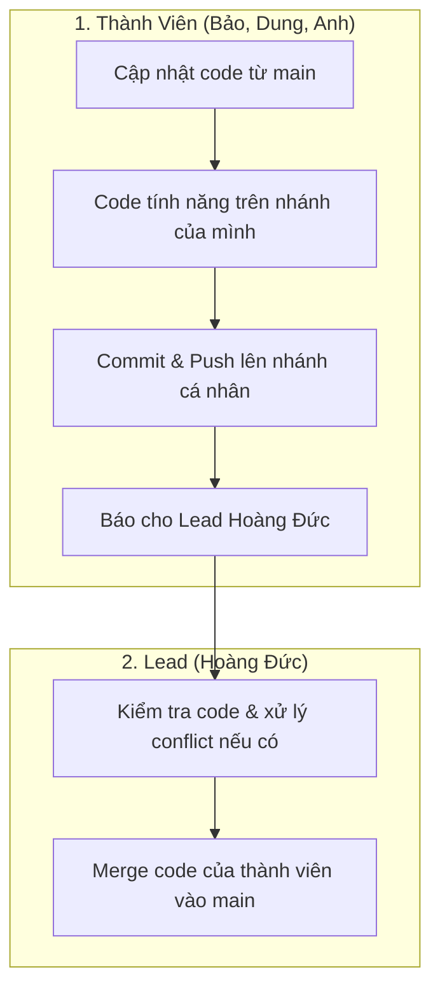

# HƯỚNG DẪN SỬ DỤNG GIT & QUY TRÌNH HỢP TÁC NHÓM
## DỰ ÁN WEBSITE ĐOÀN KHOA HTTT (IS TIMES)

Tài liệu này hướng dẫn quy trình quản lý mã nguồn bằng Git cực kỳ đơn giản dành cho các thành viên phát triển dự án **IS Times**.

---

## 1. HỆ THỐNG CÁC NHÁNH (BRANCHES)

Dự án sử dụng mô hình Git đơn giản để tránh tối đa các bước phức tạp cho thành viên:

| Tên Nhánh | Người chịu trách nhiệm | Quyền hạn & Quy tắc |
| :--- | :--- | :--- |
| **`main`** | **Cả nhóm** | **Nhánh chính (Production):** Chứa code chạy chính thức. **Chỉ Lead (Hoàng Đức) được quyền duyệt và merge code vào đây.** |
| **`HoangDuc`** | **Hoàng Đức (Lead)** | Nhánh làm việc của Lead Hoàng Đức. |
| **`HuynhBao`** | Huỳnh Bảo | Nhánh làm việc cá nhân của Huỳnh Bảo. |
| **`DungMuoi`** | Dung Muối | Nhánh làm việc cá nhân của Dung Muối. |
| **`PhuongAnh`** | Phương Anh | Nhánh làm việc cá nhân của Phương Anh. |

---

## 2. QUY TRÌNH CỘNG TÁC ĐƠN GIẢN

Quy trình phân chia công việc cực kỳ đơn giản như sau:



---

## 3. HƯỚNG DẪN DÀNH CHO THÀNH VIÊN (BẢO, DUNG, ANH)

Mỗi khi làm việc, các thành viên chỉ cần thực hiện đúng 4 bước siêu đơn giản này:

### Bước 1: Cập nhật code mới nhất từ `main` về nhánh của bạn
*(Làm vào đầu buổi code để đảm bảo code của bạn không bị cũ)*
```bash
# 1. Chuyển sang nhánh cá nhân của bạn (ví dụ: HuynhBao)
git checkout <Ten_Nhanh_Cua_Ban>

# 2. Lấy code mới nhất từ main đè vào nhánh của bạn
git pull origin main
```

### Bước 2: Viết code phát triển tính năng
Mở VS Code lên và bắt đầu code bình thường trên nhánh cá nhân của bạn.

### Bước 3: Lưu và Đẩy code lên GitHub
*(Sau khi code xong tính năng hoặc cuối ngày làm việc)*
```bash
# 1. Thêm tất cả file đã sửa đổi
git add .

# 2. Lưu lại code kèm ghi chú ngắn gọn
git commit -m "feat: [Tên của bạn] mô tả tính năng đã làm"

# 3. Đẩy lên nhánh cá nhân trên GitHub
git push origin <Ten_Nhanh_Cua_Ban>
```

### Bước 4: Nhắn tin báo cho Lead
Sau khi đã push xong, bạn chỉ cần nhắn tin cho **Lead (Hoàng Đức)**:
> *"Anh Đức ơi, em đã push xong tính năng [tên tính năng] lên nhánh của em rồi nha, merge giúp em với"*

**Xong! Thành viên không cần làm gì thêm, không cần tạo PR phức tạp.**

---

## 4. HƯỚNG DẪN DÀNH CHO LEAD (HOÀNG ĐỨC)

Là **Lead**, Hoàng Đức chịu trách nhiệm gộp code từ nhánh của thành viên vào nhánh `main`. Đức có thể chọn 1 trong 2 cách sau:

### Cách 1: Merge trực tiếp trên GitHub bằng Pull Request (Khuyên dùng)
1. Truy cập vào Repository của dự án trên GitHub.
2. Đức sẽ thấy thông báo màu vàng của nhánh vừa push lên. Nhấn **Compare & pull request**.
3. Tạo PR và kiểm tra xem có bị xung đột (Conflict) không.
4. Nếu nút merge hiện màu xanh lá (không conflict): Nhấn **Merge pull request** -> **Confirm merge**.
5. Nếu bị báo Conflict đỏ: Làm theo **Cách 2 (Dưới máy local)** để giải quyết.

### Cách 2: Merge và Giải quyết xung đột dưới máy Local
Nếu có xung đột code giữa nhánh thành viên với `main`, Đức chạy các lệnh sau dưới máy mình để sửa:
```bash
# 1. Chuyển sang main và cập nhật mới nhất
git checkout main
git pull origin main

# 2. Tải nhánh của thành viên về (ví dụ nhánh HuynhBao)
git fetch origin HuynhBao

# 3. Merge nhánh của thành viên vào main cục bộ
git merge origin/HuynhBao
```
*   **Nếu có conflict đỏ hiện lên**: Đức mở VS Code, tìm các file bị đỏ để sửa lại dòng code cho đúng (thảo luận với thành viên nếu cần).
*   **Sau khi sửa xong conflict (hoặc nếu không có conflict)**, Đức chạy lệnh:
    ```bash
    git add .
    git commit -m "merge: gộp nhánh HuynhBao vào main"
    git push origin main
    ```

### Quy trình tự Code & Merge của riêng Hoàng Đức (Nhánh `HoangDuc`)
Vì Đức vừa là Lead vừa code nhánh `HoangDuc`:
1. Code trên nhánh `HoangDuc`:
   ```bash
   git checkout HoangDuc
   # Code...
   git add .
   git commit -m "feat: [Đức] làm giao diện..."
   git push origin HoangDuc
   ```
2. Gộp code của mình vào `main`:
   ```bash
   git checkout main
   git pull origin main
   git merge HoangDuc
   # Fix conflict nếu có
   git push origin main
   ```

---

## 5. QUY TẮC VIẾT COMMIT MESSAGE

Hãy viết commit message theo cấu trúc sau để cả nhóm dễ theo dõi lịch sử:
*   `feat: ...` -> Khi thêm tính năng mới (Ví dụ: `feat: [Bao] them nut dang ky`)
*   `fix: ...` -> Khi sửa lỗi (Ví dụ: `fix: [Dung] sua loi font chu`)
*   `style: ...` -> Khi chỉnh giao diện, CSS (Ví dụ: `style: [Anh] chinh lai border radius`)
