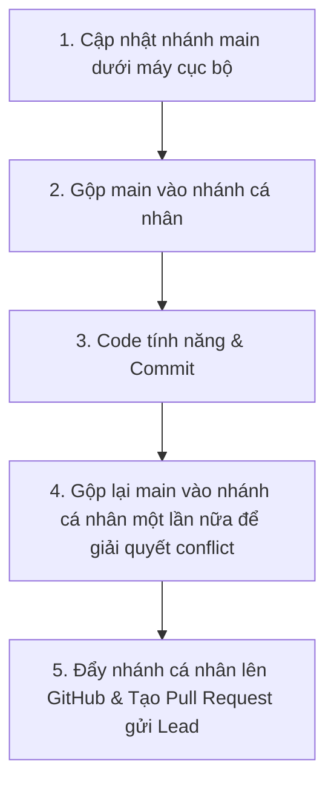

# HƯỚNG DẪN SỬ DỤNG GIT & QUY TRÌNH HỢP TÁC NHÓM
## DỰ ÁN WEBSITE ĐOÀN KHOA HTTT (IS TIMES)

Tài liệu này hướng dẫn chi tiết quy trình quản lý mã nguồn bằng Git dành riêng cho các thành viên phát triển dự án **IS Times**. Hãy tuân thủ nghiêm ngặt quy trình này để tránh xung đột mã nguồn (conflict) và mất mát dữ liệu.

---

## 1. HỆ THỐNG CÁC NHÁNH (BRANCHES)

Dự án sử dụng mô hình Git Workflow đơn giản và hiệu quả với các nhánh sau:

| Tên Nhánh | Người chịu trách nhiệm | Quyền hạn & Quy tắc |
| :--- | :--- | :--- |
| **`main`** | **Cả nhóm** | **Nhánh chính (Production):** Chứa code ổn định nhất. **Chỉ Lead (Hoàng Đức) được quyền duyệt và merge code vào đây.** |
| **`HoangDuc`** | Hoàng Đức | Nhánh phát triển cá nhân của Hoàng Đức. |
| **`HuynhBao`** | Huỳnh Bảo | Nhánh phát triển cá nhân của Huỳnh Bảo. |
| **`DungMuoi`** | Dung Muối | Nhánh phát triển cá nhân của Dung Muối. |
| **`PhuongAnh`** | Phương Anh | Nhánh phát triển cá nhân của Phương Anh. |

---

## 2. QUY TRÌNH CỘNG TÁC CHUNG

Để tránh xung đột code, quy trình làm việc được đơn giản hóa như sau:



### Giải thích chi tiết các bước trên máy của bạn (Thành viên):

*   **Bước 1 & 2 (Đầu buổi code):** Lấy code mới nhất trên server về máy mình (`pull`), sau đó gộp (`merge`) nhánh `main` vào nhánh cá nhân của bạn. Việc này giúp nhánh của bạn luôn có những tính năng mới nhất mà người khác vừa cập nhật.
*   **Bước 3 (Trong lúc code):** Bạn viết code, tạo các file mới và chỉnh sửa giao diện. Khi hoàn thành một tính năng thì lưu lại (`commit`).
*   **Bước 4 (Giải quyết conflict cục bộ):** Trước khi đưa code lên mạng, bạn cần lấy code `main` gộp vào nhánh của mình một lần nữa. **Tại sao?** Vì trong lúc bạn đang code, có thể người khác đã merge tính năng của họ lên `main` rồi. Gộp `main` ở bước này giúp bạn phát hiện xem code của mình có bị đè hay trùng dòng với ai không để sửa trực tiếp trên máy của mình trước.
*   **Bước 5 (Đưa lên GitHub & Báo Lead):** Đẩy nhánh cá nhân đã sạch lỗi lên GitHub, rồi bấm tạo **Pull Request (PR)** để gửi yêu cầu gộp code vào `main`. Lead sẽ kiểm tra xem code chạy ổn định không rồi bấm duyệt.

---

## 3. HƯỚNG DẪN CHI TIẾT CHO THÀNH VIÊN (HUỲNH BẢO, DUNG MÚI, PHƯƠNG ANH)

Dưới đây là các lệnh Git chính xác tương ứng với 5 bước trên. Bạn chỉ cần làm theo thứ tự này:

### Bước 1: Cập nhật code `main` mới nhất trên máy của bạn
```bash
# Chuyển sang nhánh main cục bộ
git checkout main

# Tải code mới nhất từ GitHub về máy
git pull origin main
```

### Bước 2: Chuyển về nhánh cá nhân và gộp code `main` vừa tải vào
```bash
# Chuyển về nhánh của bạn (ví dụ: HuynhBao)
git checkout <Ten_Nhanh_Cua_Ban>

# Gộp code từ main vào nhánh của bạn
git merge main
```

### Bước 3: Tiến hành Code tính năng & Commit (Lưu lại)
*(Sau khi code xong một tính năng hoặc cuối buổi làm việc)*
```bash
# Xem các file đã sửa đổi
git status

# Thêm các file thay đổi vào hàng chờ commit
git add .

# Lưu code kèm mô tả
git commit -m "feat: [Tên bạn] mô tả tính năng đã code"
```

### Bước 4: Kiểm tra và giải quyết xung đột (Conflict) lần cuối với `main`
*(Bước này cực kỳ quan trọng để đảm bảo khi đẩy lên GitHub không bị lỗi conflict)*
```bash
# 1. Chuyển sang main để lấy code mới nhất (nhỡ trong lúc bạn code có người khác đã merge code mới)
git checkout main
git pull origin main

# 2. Quay lại nhánh của bạn
git checkout <Ten_Nhanh_Cua_Ban>

# 3. Gộp main vào nhánh của bạn để kiểm tra conflict
git merge main
```
> [!IMPORTANT]
> *   Nếu màn hình hiện **"Already up to date"**: Chúc mừng bạn, không có xung đột nào! Chuyển sang Bước 5.
> *   Nếu màn hình hiện **"CONFLICT (content): Merge conflict in..."**:
>     1. Mở VS Code lên, tìm file màu đỏ có chữ **C** (Conflict).
>     2. Lựa chọn dòng code muốn giữ lại (Accept Current Change là code của bạn, Accept Incoming Change là code trên main).
>     3. Sau khi sửa xong, lưu file đó lại và gõ lệnh sau để hoàn thành:
>        ```bash
>        git add .
>        git commit -m "fix: giải quyết conflict với main"
>        ```

### Bước 5: Đẩy code lên GitHub & Tạo Pull Request gửi Lead
```bash
# Đẩy code lên nhánh của bạn trên GitHub
git push origin <Ten_Nhanh_Cua_Ban>
```
1. Lên trang web GitHub của dự án.
2. Bạn sẽ thấy nút **"Compare & pull request"** màu vàng xuất hiện, click vào đó.
3. Kiểm tra xem hướng mũi tên có đúng là: `main` <- `<Ten_Nhanh_Cua_Ban>` hay không.
4. Nhập mô tả ngắn gọn và bấm **Create pull request**.
5. Nhắn tin cho **Hoàng Đức** duyệt merge. **Thành viên không được tự bấm nút Merge trên GitHub.**

---

## 4. HƯỚNG DẪN DÀNH RIÊNG CHO Lead (HOÀNG ĐỨC)

Là Lead, Hoàng Đức chịu trách nhiệm **kiểm tra chất lượng** và **merge code** từ các nhánh của thành viên vào nhánh `main`.

### 4.1. Cách Merge code của thành viên trên GitHub (Khuyên Dùng)
Khi có thành viên gửi Pull Request (PR):
1. Truy cập tab **Pull Requests** trên GitHub.
2. Click chọn PR cần kiểm tra.
3. Vào tab **Files changed** để xem thành viên đó đã sửa đổi những gì.
4. Nếu code ổn định và không bị conflict:
   - Nhấn nút **Merge pull request** màu xanh lá.
   - Nhấn tiếp **Confirm merge**.
5. Nếu bị báo **"This branch has conflicts that must be resolved"**:
   - Yêu cầu thành viên đó làm lại **Bước 4** cục bộ dưới máy của họ để sửa conflict rồi push lại lên GitHub (PR sẽ tự động cập nhật).

### 4.2. Cách Merge code của thành viên bằng dòng lệnh (Nếu cần test trước dưới máy local)
Nếu muốn test code của thành viên dưới máy của mình trước khi chính thức đưa lên `main`:
```bash
# 1. Chuyển về main và cập nhật mới nhất
git checkout main
git pull origin main

# 2. Tải nhánh của thành viên về máy (ví dụ nhánh HuynhBao)
git fetch origin HuynhBao

# 3. Merge nhánh của thành viên vào main cục bộ
git merge origin/HuynhBao

# 4. Chạy thử dự án dưới local (ng serve) để kiểm tra xem có lỗi không.
# 5. Nếu mọi thứ hoạt động tốt, push trực tiếp lên main trên GitHub:
git push origin main
```

### 4.3. Quy trình tự Code & Merge của riêng Hoàng Đức (Nhánh `HoangDuc`)
Vì Đức vừa là Lead vừa code nhánh `HoangDuc`, quy trình thực hiện như sau:
1. Code trên nhánh `HoangDuc` như bình thường:
   ```bash
   git checkout HoangDuc
   # Code...
   git add .
   git commit -m "feat: [Đức] làm giao diện..."
   git push origin HoangDuc
   ```
2. Cập nhật `main` và kiểm tra conflict:
   ```bash
   git checkout main
   git pull origin main
   git checkout HoangDuc
   git merge main  # Tự xử lý conflict nếu có trên VS Code
   git push origin HoangDuc
   ```
3. Lên GitHub, tạo PR từ `HoangDuc` -> `main`. Đức có thể tự review và nhấn nút **Merge** của chính mình.

---

## 5. QUY TẮC COMMIT & GIẢI QUYẾT XUNG ĐỘT (RESOLVE CONFLICT)

### 5.1. Quy tắc viết commit message (Commit Convention)
Hãy viết commit message có cấu trúc để cả nhóm dễ theo dõi lịch sử dự án:
*   `feat: ...` -> Khi thêm tính năng mới (Ví dụ: `feat: thêm component đăng ký`)
*   `fix: ...` -> Khi sửa lỗi (Ví dụ: `fix: sửa lỗi hiển thị nút bấm trên mobile`)
*   `style: ...` -> Khi chỉnh sửa giao diện/CSS mà không đổi logic (Ví dụ: `style: chỉnh màu nền header`)
*   `docs: ...` -> Khi viết/sửa tài liệu hướng dẫn (Ví dụ: `docs: cập nhật hướng dẫn cài đặt`)

### 5.2. Cách giải quyết xung đột (Conflict) khi Merge
Xung đột xảy ra khi hai người cùng sửa một dòng code ở một file. Khi gặp xung đột, thực hiện các bước sau:

1. **Mở VS Code**: Các file bị xung đột sẽ hiển thị màu đỏ với chữ **C** (Conflict).
2. **Xem nội dung file**: VS Code sẽ hiển thị các phần code khác biệt kèm 3 lựa chọn chính:
   *   *Accept Current Change*: Giữ lại code của bạn.
   *   *Accept Incoming Change*: Lấy code từ nhánh khác (ví dụ từ `main`).
   *   *Accept Both Changes*: Lấy cả hai phiên bản code.
3. **Thảo luận**: Nhắn tin trực tiếp cho người viết phần code đó để thảo luận nên giữ lại cái nào.
4. **Lưu và Commit lại**: Sau khi chọn xong, lưu file đó lại. Chạy lệnh:
   ```bash
   git add .
   git commit -m "fix: resolve conflict with main"
   ```

> [!WARNING]
> **TUYỆT ĐỐI KHÔNG** dùng cờ `--force` (`-f`) khi push code trừ khi hiểu cực kỳ rõ mình đang làm gì. Sử dụng `--force` có thể đè và xóa mất toàn bộ code của các thành viên khác trên GitHub.
