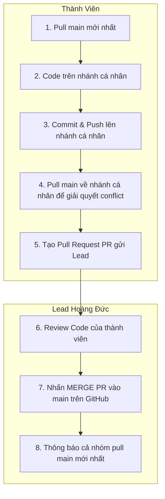

# HƯỚNG DẪN SỬ DỤNG GIT & QUY TRÌNH HỢP TÁC NHÓM
## DỰ ÁN WEBSITE ĐOÀN KHOA HTTT (IS TIMES)

Tài liệu này hướng dẫn chi tiết quy trình quản lý mã nguồn bằng Git dành riêng cho các thành viên phát triển dự án **IS Times**. Hãy tuân thủ nghiêm ngặt quy trình này để tránh xung đột mã nguồn (conflict) và mất mát dữ liệu.

---

## 1. HỆ THỐNG CÁC NHÁNH (BRANCHES)

Dự án sử dụng mô hình Git Workflow đơn giản và hiệu quả với các nhánh sau:

| Tên Nhánh | Người chịu trách nhiệm | Quyền hạn & Quy tắc |
| :--- | :--- | :--- |
| **`main`** | **Cả nhóm** | **Nhánh chính (Production):** Chứa code ổn định nhất. **Chỉ Lead (Hoàng Đức) được quyền duyệt và merge code vào đây.** |
| **`HoangDuc`** | **Hoàng Đức (Lead)** | Nhánh phát triển cá nhân của Hoàng Đức. |
| **`HuynhBao`** | Huỳnh Bảo | Nhánh phát triển cá nhân của Huỳnh Bảo. |
| **`DungMuoi`** | Dung Muối | Nhánh phát triển cá nhân của Dung Muối. |
| **`PhuongAnh`** | Phương Anh | Nhánh phát triển cá nhân của Phương Anh. |

---

## 2. QUY TRÌNH CỘNG TÁC CHUNG

Để tránh xung đột code, quy trình phân vai được quy định như sau:



---

## 3. HƯỚNG DẪN CHI TIẾT CHO THÀNH VIÊN (HUỲNH BẢO, DUNG MÚI, PHƯƠNG ANH)

Các thành viên chỉ làm việc trên nhánh cá nhân của mình, giải quyết conflict cục bộ, đẩy lên GitHub và tạo Pull Request (PR). **Không tự ý merge PR vào `main`.**

### Quy trình làm việc hàng ngày của thành viên:

#### Bước 1: Cập nhật code mới nhất từ `main` đầu ngày làm việc
```bash
# Chuyển về nhánh main
git checkout main

# Pull code mới nhất từ server về
git pull origin main
```

#### Bước 2: Hợp nhất code mới nhất từ `main` vào nhánh cá nhân của mình
```bash
# Chuyển về nhánh cá nhân của bạn
git checkout <Ten_Nhanh_Cua_Ban>

# Hợp nhất code
git merge main
```
*(Nếu có conflict, hãy mở VS Code để sửa lỗi, sau đó lưu và commit)*

#### Bước 3: Code tính năng & Commit
Làm việc trên các file code của bạn. Sau khi hoàn thành một tính năng:
```bash
git status
git add .
git commit -m "feat: [Tên của bạn] mô tả tính năng đã làm"
```

#### Bước 4: Đẩy code lên GitHub
```bash
git push origin <Ten_Nhanh_Cua_Ban>
```

#### Bước 5: Tạo Pull Request (PR) & Báo Lead
1. Truy cập vào Repository trên GitHub.
2. Nhấn nút **"Compare & pull request"** màu vàng xuất hiện trên giao diện.
3. Chọn Base: `main` <- Compare: `<Ten_Nhanh_Cua_Ban>`.
4. Viết mô tả ngắn và nhấn **Create pull request**.
5. Nhắn tin cho **Hoàng Đức** để kiểm tra và duyệt merge.

---

## 4. HƯỚNG DẪN DÀNH RIÊNG CHO Lead (HOÀNG ĐỨC)

Là Lead, Hoàng Đức chịu trách nhiệm **kiểm tra chất lượng** và **merge code** từ các nhánh của thành viên vào nhánh `main`.

### 4.1. Cách Merge code của thành viên trên GitHub (Khuyên Dùng)
Khi có thành viên gửi Pull Request (PR):
1. Truy cập tab **Pull Requests** trên GitHub.
2. Click chọn PR cần kiểm tra.
3. Vào tab **Files changed** để xem thành viên đó đã sửa đổi những gì.
4. Nếu code ổn định và không bị conflict:
   - Nhấn nút **Merge pull request** màu xanh lá.
   - Nhấn tiếp **Confirm merge**.
5. Nếu bị báo **"This branch has conflicts that must be resolved"**:
   - Yêu cầu thành viên đó tự pull `main` về nhánh của họ dưới máy local, tự fix conflict rồi push lại lên GitHub (PR sẽ tự động cập nhật).

### 4.2. Cách Merge code của thành viên bằng dòng lệnh (Nếu cần test trước dưới máy local)
Nếu muốn test code của thành viên dưới máy của mình trước khi chính thức đưa lên `main`:
```bash
# 1. Chuyển về main và cập nhật mới nhất
git checkout main
git pull origin main

# 2. Tải nhánh của thành viên về máy (ví dụ nhánh HuynhBao)
git fetch origin HuynhBao

# 3. Merge nhánh của thành viên vào main cục bộ
git merge origin/HuynhBao

# 4. Chạy thử dự án dưới local (ng serve) để kiểm tra xem có lỗi không.
# 5. Nếu mọi thứ hoạt động tốt, push trực tiếp lên main trên GitHub:
git push origin main
```

### 4.3. Quy trình tự Code & Merge của riêng Hoàng Đức (Nhánh `HoangDuc`)
Vì Đức vừa là Lead vừa code nhánh `HoangDuc`, quy trình thực hiện như sau:
1. Code trên nhánh `HoangDuc` như bình thường:
   ```bash
   git checkout HoangDuc
   # Code...
   git add .
   git commit -m "feat: [Đức] làm giao diện..."
   git push origin HoangDuc
   ```
2. Cập nhật `main` và kiểm tra conflict:
   ```bash
   git checkout main
   git pull origin main
   git checkout HoangDuc
   git merge main  # Tự xử lý conflict nếu có trên VS Code
   git push origin HoangDuc
   ```
3. Lên GitHub, tạo PR từ `HoangDuc` -> `main`. Đức có thể tự review và nhấn nút **Merge** của chính mình.

---

## 5. QUY TẮC COMMIT & GIẢI QUYẾT XUNG ĐỘT (RESOLVE CONFLICT)

### 5.1. Quy tắc viết commit message (Commit Convention)
Hãy viết commit message có cấu trúc để cả nhóm dễ theo dõi lịch sử dự án:
*   `feat: ...` -> Khi thêm tính năng mới (Ví dụ: `feat: thêm component đăng ký`)
*   `fix: ...` -> Khi sửa lỗi (Ví dụ: `fix: sửa lỗi hiển thị nút bấm trên mobile`)
*   `style: ...` -> Khi chỉnh sửa giao diện/CSS mà không đổi logic (Ví dụ: `style: chỉnh màu nền header`)
*   `docs: ...` -> Khi viết/sửa tài liệu hướng dẫn (Ví dụ: `docs: cập nhật hướng dẫn cài đặt`)

### 5.2. Cách giải quyết xung đột (Conflict) khi Merge
Xung đột xảy ra khi hai người cùng sửa một dòng code ở một file. Khi bạn thực hiện `git merge` hoặc `git pull` và gặp xung đột:

1. **Mở VS Code**: Các file bị xung đột sẽ hiển thị màu đỏ với chữ **C** (Conflict).
2. **Xem nội dung file**: VS Code sẽ hiển thị các phần code khác biệt kèm 4 lựa chọn:
   *   *Accept Current Change*: Giữ lại code của bạn.
   *   *Accept Incoming Change*: Lấy code từ nhánh khác (ví dụ từ `main`).
   *   *Accept Both Changes*: Lấy cả hai phiên bản code.
3. **Thảo luận**: Nhắn tin trực tiếp cho người viết phần code đó để thảo luận nên giữ lại cái nào.
4. **Lưu và Commit lại**: Sau khi chọn xong, lưu file đó lại. Chạy lệnh:
   ```bash
   git add .
   git commit -m "fix: resolve conflict with main"
   ```

> [!WARNING]
> **TUYỆT ĐỐI KHÔNG** dùng cờ `--force` (`-f`) khi push code trừ khi hiểu cực kỳ rõ mình đang làm gì. Sử dụng `--force` có thể đè và xóa mất toàn bộ code của các thành viên khác trên GitHub.
